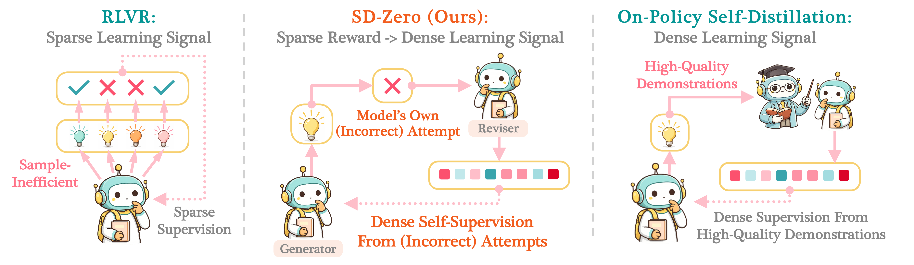
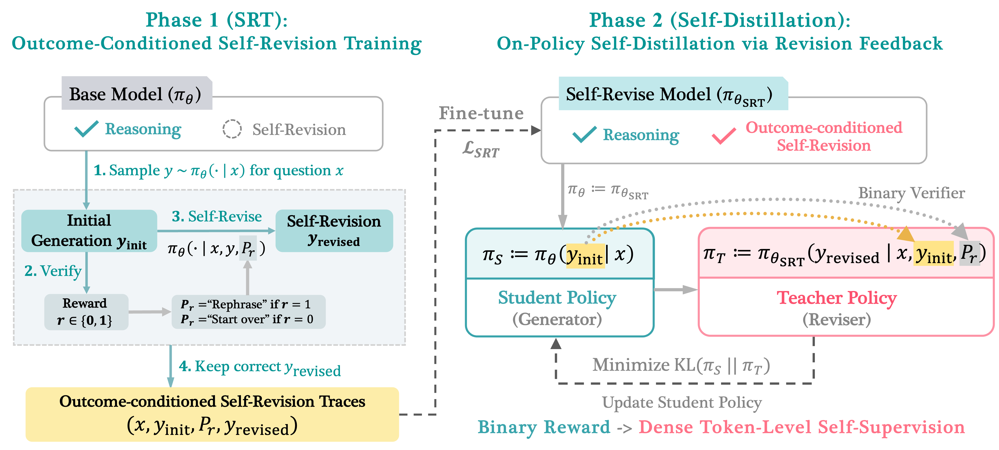

# Self-Distillation Zero



This repo is the implementation of the SD-Zero paper: [**Self-Distillation Zero: Self-Revision Turns Binary Rewards into Dense Supervision**](https://arxiv.org/html/2604.12002v1).



**Phase 1 — Self-Revision Training (SRT).** For each problem `x` with
ground-truth answer `a`, the base model samples an initial response
`y_init`, that response is judged with the binary reward
`r = 1[answer(y_init) == a]`, an outcome-conditioned control phrase `P_r`
is appended, and the model samples a revised response
`y_revised ~ pi(. | x, y_init, P_r)`. Verified-correct revision traces
`D_revision = {(x, y_init, P_r, y_revised)}` are then turned into a small
two-stage SFT dataset that teaches the model both to *generate* and to
*revise*.

**Phase 2 — On-policy Self-Distillation via Revision Feedback.** The frozen
SRT model from Phase 1 acts as the teacher. The student samples
`y ~ pi_theta(. | x)`, gets the same binary reward `r`, and the teacher is
given `chat(x) + y + P_r + y`; the per-token logits over the second copy of
`y` are distilled into the student via the KL loss of Section 2.2.

## Release progress

- [x] Phase 1: Self-Revision Training (SRT) — `self-revision-training/`
- [x] End-to-end SRT data collection (`scripts/run_srt_data.sh`)
- [x] Two-stage SFT driver (`scripts/sft.sh`)
- [x] Phase 2: Self-Distillation — `self-distillation/` + `scripts/distill.sh`
<!-- - [ ] Pretrained SRT checkpoints -->

<!-- ## Layout

```
SD-Zero/
├── self-revision-training/      # Phase 1 sources
│   ├── self_critique_pipeline.py  # vLLM data-collection pipeline
│   ├── prepare_data.py            # split D_revision into the two SFT stages
│   ├── sft/                       # FSDP SFT entry point + configs
│   ├── math_evaluation/           # vendored math grader (MIT)
│   ├── code_runner/               # sandboxed code judge
│   └── requirements.txt           # Phase 1 deps (data collection + SFT)
├── self-distillation/           # Phase 2 sources (NeMo-RL fork)
│   ├── nemo_rl/algorithms/distillation.py    # on-policy self-distillation loop
│   ├── examples/run_distillation.py          # entry point
│   ├── examples/configs/distillation_math.yaml
│   └── pyproject.toml                        # uv-managed Phase 2 environment
└── scripts/
    ├── run_srt_data.sh          # Phase 1, step 1: collect D_revision + split
    ├── sft.sh                   # Phase 1, step 2: 2-stage SFT
    └── distill.sh               # Phase 2: on-policy self-distillation
``` -->

> The two phases use different dependency stacks and live in **separate
> virtualenvs** (`SD-Zero/.venv` for Phase 1, `SD-Zero/self-distillation/.venv`
> for Phase 2). Each phase below has its own setup block — only set up the
> phase you intend to run.

## Phase 1 — Self-Revision Training

### Environment

A single CUDA GPU is required for data collection; SFT uses FSDP across all
visible GPUs. Everything is pinned in `self-revision-training/requirements.txt`.

With `uv` (recommended — install once from
<https://docs.astral.sh/uv/getting-started/installation/>):

```bash
cd SD-Zero
uv venv --python 3.11 .venv
source .venv/bin/activate
uv pip install -r self-revision-training/requirements.txt
```

Or with plain `pip`:

```bash
cd SD-Zero
python -m venv .venv
source .venv/bin/activate
pip install --upgrade pip
pip install -r self-revision-training/requirements.txt
```

### Run

Run the two scripts **in order**.

#### Step 1: collect `D_revision` and build the two SFT stages

```bash
bash scripts/run_srt_data.sh                # math (default)
# or
MODE=code bash scripts/run_srt_data.sh      # code
```

The script:

1. Calls `self_critique_pipeline.py` to sample `(y_init, y_revised)` pairs
   from the base model and keep only revisions that are verified correct,
   stopping at **6 000** tuples. Output:
   `self-revision-training/outputs/<tag>/d_revision.json`.
2. Calls `prepare_data.py` to split those 6 000 tuples into the two SFT
   stages from Section 2.1 of the paper, writing them under
   `self-revision-training/train_data/`:
   - **Stage 1 — generation** (4 000):
     `prompt = x`, `completion = y_init + P_r + y_revised`.
   - **Stage 2 — revision** (2 000):
     `prompt = x + y_init + P_r`, `completion = y_revised`.

Common knobs (env vars; defaults shown):

```bash
MODE=math                            # math | code
MODEL_PATH=Qwen/Qwen3-4B-Instruct-2507
TARGET_REVISION_SAMPLES=6000
STAGE1_SIZE=4000  STAGE2_SIZE=2000
NUM_RESPONSES=1   NUM_REVISIONS=1
BATCH_SIZE=64     TEMPERATURE=1.0  TOP_P=0.9  MAX_TOKENS=16384
REVISE_CORRECT=0                     # 1 to also revise correct y_init (paper r=1 branch)
```

#### Step 2: two-stage SFT

```bash
bash scripts/sft.sh
```

Two sequential FSDP runs over the files produced in step 1:

1. **Stage 1** (generation loss, 4 k): base model → `ckpts/.../stage1/`.
2. **Stage 2** (revision loss, 2 k): continues from the stage-1 checkpoint →
   `ckpts/.../stage2/` — the final SRT model.

Common knobs:

```bash
BASE_MODEL=Qwen/Qwen3-4B-Instruct-2507
DATA_PREFIX=r1_<model>_srt           # filename prefix produced by step 1
EPOCHS_STAGE1=3  EPOCHS_STAGE2=3
LR_STAGE1=5e-6   LR_STAGE2=5e-6
```

## Phase 2 — On-policy Self-Distillation

### Approach

Phase 2 (Section 2.2 of the paper) turns the SRT checkpoint from Phase 1
into both *teacher* and *teacher* for on-policy self-distillation. For each batch of
problems:

1. The **student** (initialized from the SRT checkpoint) samples
   `y ~ pi_theta(. | x)`.
2. `y` is graded against the ground truth to give a binary reward
   `r = 1[answer(y) == a]`.
3. The outcome-conditioned phrase `P_r` is chosen — the **same strings as
   Phase 1**:
   - `r = 1`: `"Let me rephrase the above solution."`
   - `r = 0`: `"Wait, this response is wrong. Let me correct it."`
4. The frozen **teacher** (SRT model) is run on

   ```
   chat_template(user=x)            # ends with the assistant-start marker
   + y                              # student response, playing y_init
   + "\n\n" + P_r + "\n\n"          # delimiter
   + y                              # teacher-forced y_<t for t = 1..|y|
   ```

   The token-loss mask covers only the second copy of `y`; the teacher's
   per-token logits there give `pi_theta_SRT(. | x, y, P_r, y_<t)`.
5. The student is trained against the Section 2.2 token-level KL loss

   ```
   L = E_{(x,a)~D} E_{y~pi_theta(.|x)} sum_{t=1..|y|}
         D_KL( pi_theta(. | x, y_<t)  ||  pi_theta_SRT(. | x, y, P_r, y_<t) )
   ```

### Environment

Phase 2 is a fork of [NeMo-RL](https://github.com/NVIDIA-NeMo/RL) and uses its own `uv`-managed environment in
`self-distillation/`, driven by `self-distillation/pyproject.toml` (with
heavier deps: vLLM, Megatron Core, FlashAttention, Ray, etc.). Do **not**
reuse the Phase 1 `.venv` for this — it doesn't pin the right CUDA stack.

```bash
cd SD-Zero/self-distillation
uv venv                       # creates self-distillation/.venv from .python-version
source setup_env.sh           # sets CUDA / cuDNN / NCCL paths used by uv run
```

After this, `scripts/distill.sh` launches Phase 2 with `uv run`, which
installs the locked dependencies from `pyproject.toml` on first call and
sources `setup_env.sh` itself.

### Run

```bash
bash scripts/distill.sh
```

<!-- The script wraps `self-distillation/examples/run_distillation.py` with the
`distillation_math.yaml` config (DeepScaler train, AIME2024 val) and one
DTensor process per visible GPU. Override defaults via env vars:

```bash
STUDENT_MODEL=Qwen/Qwen3-4B-Instruct-2507   # SRT student (init from Phase 1 ckpt)
TEACHER_MODEL=$STUDENT_MODEL                # frozen SRT teacher (same by default)
TRAIN_DATASET=DeepScaler                    # validation: VAL_DATASET=AIME2024
MAX_TOTAL_SEQUENCE_LENGTH=8192              # cap on the student input |x|+|y|
MAX_TEACHER_TOKENS=32768                    # cap on |x|+2|y|+|delim| (y is truncated to fit)
NUM_PROMPTS_PER_STEP=128
TRAIN_GLOBAL_BATCH_SIZE=128
MAX_NUM_STEPS=1000  MAX_NUM_EPOCHS=5  LR=5e-6
TOPK=64                                     # top-k teacher logits used in the KL target
KL_TYPE=mixed                               # forward | reverse | mixed
MIXED_KL_WEIGHT=0.5                         # weight of forward KL when kl_type=mixed
``` -->

<!-- The Phase 2 driver builds the teacher prompt on the fly from each batch's
`(x, y, r)` — no extra dataset columns are required. -->


## Datasets used in the paper

- **Math:** [`open-r1/OpenR1-Math-220k`](https://huggingface.co/datasets/open-r1/OpenR1-Math-220k)
- **Code:** [`open-r1/codeforces-cots`](https://huggingface.co/datasets/open-r1/codeforces-cots) (`solutions` subset)

Local JSON/JSONL files are also accepted via the `DATASET=` env var; each
record needs `problem`/`question` + `answer`/`solution` (math) or the
standard `prompt` + test schema (code).

## Citation

```
@article{he2026sdzero,
  title   = {Self-Distillation Zero: Self-Revision Turns Binary Rewards into Dense Supervision},
  author  = {He, Yinghui and Kaur, Simran and Bhaskar, Adithya and Yang, Yongjin
             and Liu, Jiarui and Ri, Narutatsu and Fowl, Liam and Panigrahi, Abhishek
             and Chen, Danqi and Arora, Sanjeev},
  journal = {arXiv preprint arXiv:2604.12002},
  year    = {2026}
}
```
